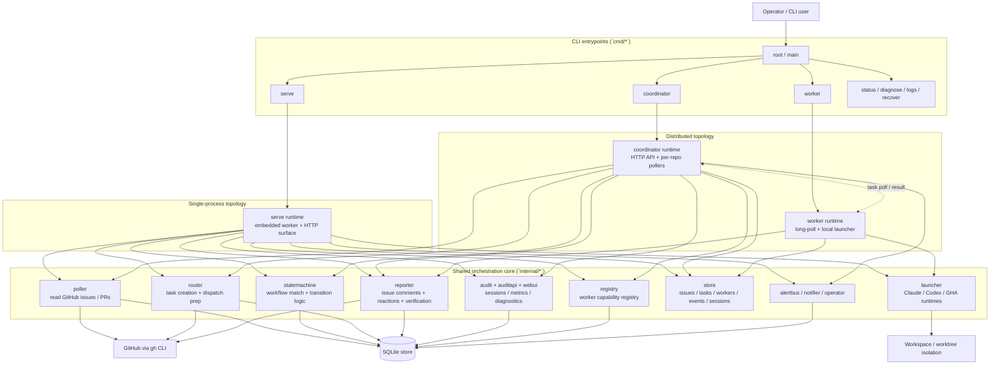

# Workbuddy

GitHub Issue-driven agent orchestration platform. Workbuddy watches GitHub Issues, maps labels to workflow states, dispatches the matching agent runtime, and lets the agent advance the workflow by writing labels back through `gh`.

Today the repository implements two runtime shapes over one shared core:

- `workbuddy serve` for single-process deployment
- `workbuddy coordinator` + `workbuddy worker` for distributed deployment

## Architecture



## Module Boundaries

- `cmd/*` is the assembly layer: commands wire concrete runtimes, flags, HTTP surfaces, and long-lived goroutines together.
- `internal/poller` is the GitHub read boundary: it diffs issue / PR snapshots and emits change events, but does not decide workflow transitions.
- `internal/statemachine` is the control boundary: it maps labels to workflow states, handles retries / stuck detection / join logic, and emits dispatch requests.
- `internal/router` is the task-preparation boundary: it persists tasks, gathers GitHub context, creates workspaces, and hands execution-ready work to a worker or coordinator queue.
- `internal/launcher` is the runtime boundary: it normalizes Claude, Codex, and GitHub Actions execution behind one session/result contract.
- `internal/reporter` is the GitHub write boundary: it posts comments, reactions, and verification outcomes back to Issues.
- `internal/store` is the persistence boundary: it owns task, worker, cache, event, dependency, and session state in SQLite.
- `internal/audit`, `internal/auditapi`, and `internal/webui` are observation surfaces: they expose metrics, events, sessions, and runtime diagnostics without owning orchestration decisions.

## Install

### Binary

```bash
curl -fsSL https://raw.githubusercontent.com/Lincyaw/workbuddy/main/install.sh | bash
```

Or build from source:

```bash
go build -o workbuddy .
```

### Deploy as a service

Install the current `workbuddy` binary into a managed location and optionally
write a systemd unit in one step:

```bash
workbuddy deploy install \
  --name workbuddy \
  --scope user \
  --systemd \
  --working-directory "$PWD"
```

That writes a deployment manifest under the selected scope, so you can later
redeploy the current binary or upgrade to the latest GitHub release without
retyping the service definition:

```bash
workbuddy deploy redeploy --name workbuddy --scope user
workbuddy deploy upgrade --name workbuddy --scope user --version latest
```

Managed deployments can also be paused, resumed, or removed in place:

```bash
workbuddy deploy stop --name workbuddy --scope user
workbuddy deploy start --name workbuddy --scope user
workbuddy deploy delete --name workbuddy --scope user
```

`deploy delete` removes the recorded manifest and systemd unit, but leaves the
installed binary in place.

`deploy install` defaults to `workbuddy serve`, but you can record dedicated
distributed roles by passing the runtime command after `--`.

Coordinator service example:

```bash
sudo workbuddy deploy install \
  --name workbuddy-coordinator \
  --scope system \
  --systemd \
  --working-directory /srv/workbuddy \
  -- coordinator --listen 0.0.0.0:8081 --db /srv/workbuddy/.workbuddy/workbuddy.db
```

Worker service example:

```bash
sudo workbuddy deploy install \
  --name workbuddy-worker-dev \
  --scope system \
  --systemd \
  --working-directory /srv/workbuddy-worker \
  -- worker \
     --coordinator http://127.0.0.1:8081 \
     --token-file /etc/workbuddy/auth-token \
     --role dev \
     --repos owner/repo=/srv/workbuddy-worker
```

Prefer `--token-file` (or `WORKBUDDY_AUTH_TOKEN` in the service env) over the
plain `--token` flag — the plain form leaks into `ps` and shell history and
now prints a deprecation warning.

This makes the split explicit:

- `workbuddy deploy install ...` with no trailing command => installs `serve`
- `workbuddy deploy install ... -- coordinator ...` => installs a coordinator
- `workbuddy deploy install ... -- worker ...` => installs a worker

### Claude Code Plugin

```bash
claude plugin marketplace add https://github.com/Lincyaw/workbuddy
claude plugin install workbuddy
```

### Codex Plugin

```bash
curl -fsSL https://raw.githubusercontent.com/Lincyaw/workbuddy/main/install-codex-plugin.sh | bash
```

This syncs the repo-packaged workbuddy skills into:

- `~/.codex/skills/`
- `~/.codex/.workbuddy-installed-skills.json`

Re-running the installer is idempotent:

- existing workbuddy-managed skills are overwritten in place
- newly added upstream skills are installed automatically
- removed upstream workbuddy skills are pruned by default

## Skills

After installing the plugin, the following skills are available in Claude Code:

| Skill | Trigger | What it does |
|-------|---------|--------------|
| `/workbuddy-guide` | "how to use workbuddy", "使用指南" | Explains deployment modes, operations, and troubleshooting |
| `/setup-repo` | "configure repo", "配置仓库" | Onboards a new repo: creates labels, agent configs, and workflows |
| `/pipeline-monitor` | "monitor pipeline", "监工" | Watches agent execution, diagnoses stuck issues |
| `/merge-flow` | "merge approved PRs", "批量合并" | Merges a batch of workbuddy PRs with conflict resolution |

## License

Apache-2.0
