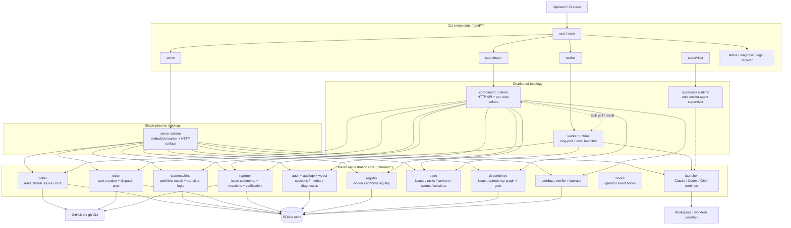

# Workbuddy

GitHub Issue-driven agent orchestration platform. Workbuddy watches GitHub Issues, maps labels to workflow states, dispatches the matching agent runtime, and lets the agent advance the workflow by writing labels back through `gh`.

Today the repository implements two runtime shapes over one shared core:

- `workbuddy coordinator` + `workbuddy worker` (+ `workbuddy supervisor`) for the
  recommended distributed deployment, installed via `workbuddy deploy install`
  as the supervisor + coordinator + worker bundle.
- `workbuddy serve` for legacy single-process / local-dev convenience only —
  it does **not** preserve in-flight agent runs across restart and is kept
  for one migration window. New deployments should use the bundle layout.

## Architecture



## Module Boundaries

- `cmd/*` is the assembly layer: commands wire concrete runtimes, flags, HTTP surfaces, and long-lived goroutines together.
- `internal/poller` is the GitHub read boundary: it diffs issue / PR snapshots and emits change events, but does not decide workflow transitions.
- `internal/statemachine` is the control boundary: it maps labels to workflow states, handles retries / stuck detection / join logic, and emits dispatch requests.
- `internal/router` is the task-preparation boundary: it persists tasks, gathers GitHub context, creates workspaces, and hands execution-ready work to a worker or coordinator queue.
- `internal/launcher` is the runtime boundary: it normalizes Claude, Codex, and GitHub Actions execution behind one session/result contract.
- `internal/reporter` is the GitHub write boundary: it posts comments, reactions, and verification outcomes back to Issues.
- `internal/store` is the persistence boundary: it owns task, worker, cache, event, dependency, and session state in SQLite.
- `internal/audit`, `internal/auditapi`, and `internal/webui` are observation surfaces: they expose metrics, events, sessions, and runtime diagnostics without owning orchestration decisions.

## Install

### Binary

```bash
curl -fsSL https://raw.githubusercontent.com/Lincyaw/workbuddy/main/install.sh | bash
```

Or build from source:

```bash
go build -o workbuddy .
```

### Deploy as a service (recommended: bundle layout)

`workbuddy deploy install` installs three systemd user units in one step:

- `workbuddy-supervisor.service` (`Type=notify`, `KillMode=process`, `Restart=always`)
- `workbuddy-coordinator.service` (`Type=simple`, `After=workbuddy-supervisor.service`)
- `workbuddy-worker.service` (`Type=simple`, `After=workbuddy-supervisor.service`)

The supervisor owns the agent subprocesses behind a unix-socket IPC, so
restarting the worker (e.g. for a binary upgrade) does **not** kill in-flight
agent runs — the worker re-attaches over the supervisor socket and continues
the events log from the right offset. This is the rolling-restart property
you actually want in production.

```bash
workbuddy deploy install --scope user \
  --working-directory "$PWD" \
  --env-file /home/<you>/.config/workbuddy/worker.env \
  --coordinator-args=--listen=127.0.0.1:8081 --coordinator-args=--auth \
  --worker-args=--coordinator=http://127.0.0.1:8081 \
  --worker-args=--token-file=/home/<you>/.config/workbuddy/auth-token \
  --worker-args=--repos=owner/repo=$PWD
```

The `--bundle` flag is no longer required (the bundle layout became the
default). It is accepted as a no-op alias so existing automation keeps
working. Trailing `-- args` are not allowed in bundle mode — use the
per-unit `--supervisor-args` / `--coordinator-args` / `--worker-args`
flags (each repeatable).

Upgrade and lifecycle commands operate on the recorded manifests:

```bash
workbuddy deploy upgrade                                # upgrades binaries; backfills supervisor unit if missing
workbuddy deploy upgrade --name workbuddy-worker        # rolling upgrade of just the worker
workbuddy deploy uninstall --scope user --force         # remove the bundle (keeps the binary on disk)
```

`workbuddy deploy upgrade` (with no flags) refuses to silently upgrade a
legacy single-process `serve` install — it errors with a migration hint.
Pass `--legacy-serve` if you genuinely want to keep the legacy layout
during the migration window.

Prefer `--token-file` (or `WORKBUDDY_AUTH_TOKEN` in the service env) over the
plain `--token` flag — the plain form leaks into `ps` and shell history and
now prints a deprecation warning.

#### Legacy single-process `serve` install (deprecated)

The single-process layout is preserved for one migration window only and
**does not preserve in-flight agent runs across restart**. Prefer the bundle
layout for any new deployment.

```bash
# Single-process serve unit (legacy):
workbuddy deploy install --legacy-serve \
  --name workbuddy --scope user --systemd --working-directory "$PWD"

# Dedicated coordinator / worker units (legacy):
sudo workbuddy deploy install --legacy-serve \
  --name workbuddy-coordinator --scope system --systemd \
  --working-directory /srv/workbuddy \
  -- coordinator --listen 0.0.0.0:8081 --db /srv/workbuddy/.workbuddy/workbuddy.db
```

See `docs/upgrade-v0.4-to-v0.5.md` for the migration walkthrough and the
`deploy` skill (Claude Code plugin) for a concise topology briefing.

### Claude Code Plugin

```bash
claude plugin marketplace add https://github.com/Lincyaw/workbuddy
claude plugin install workbuddy
```

### Codex Plugin

```bash
curl -fsSL https://raw.githubusercontent.com/Lincyaw/workbuddy/main/install-codex-plugin.sh | bash
```

This syncs the repo-packaged workbuddy skills into:

- `~/.codex/skills/`
- `~/.codex/.workbuddy-installed-skills.json`

Re-running the installer is idempotent:

- existing workbuddy-managed skills are overwritten in place
- newly added upstream skills are installed automatically
- removed upstream workbuddy skills are pruned by default

## Skills

After installing the plugin, the following skills are available in Claude Code:

| Skill | Trigger | What it does |
|-------|---------|--------------|
| `/workbuddy-guide` | "how to use workbuddy", "使用指南" | Explains deployment modes, operations, and troubleshooting |
| `/setup-repo` | "configure repo", "配置仓库" | Onboards a new repo: creates labels, agent configs, and workflows |
| `/pipeline-monitor` | "monitor pipeline", "监工" | Watches agent execution, diagnoses stuck issues |
| `/merge-flow` | "merge approved PRs", "批量合并" | Merges a batch of workbuddy PRs with conflict resolution |
| `/deploy` | "deploy workbuddy", "安装部署" | Bundle vs serve topology, systemd install, rolling restart |
| `/web-debug` | "verify frontend", "验下 webui" | End-to-end SPA validation with headless browser |

## License

Apache-2.0
